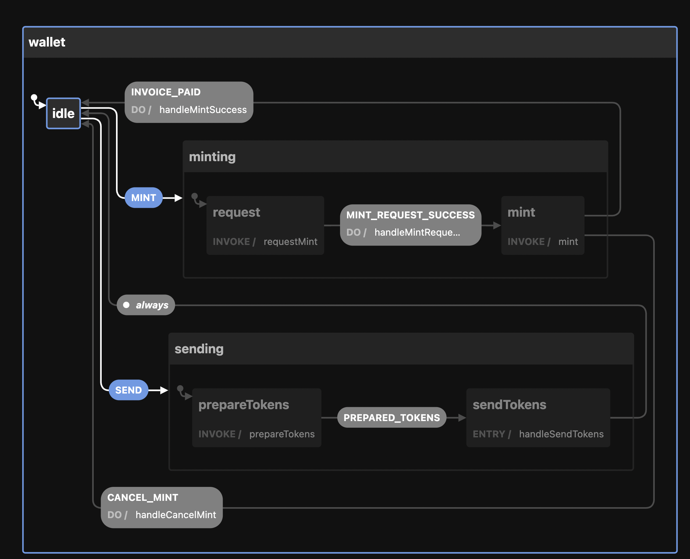

# Cashu Finite State Machine (FSM)

_This is super early and a work in progress_

This project aims to provide a framework agnostic [finite state machine](https://xstate.js.org/docs/about/concepts.html#finite-state-machines) for managing and building [cashu](https://cashu.space/) wallets.

This library leverages [xstate](https://xstate.js.org/docs/) for finite state machines

### Why Finite State Machines??

Cashu tokens are bearer assets. This means that any wallet implementation is going to need to store tokens on the client. This also means that mistakes in state management cause users to lose funds, which is really bad. It's a hard problem that every wallet will need to solve.

Finite state machines help model all possible states a wallet can be in to help prevent "impossible" states from arising, and allows developers to reason about the state of their application through [state charts](https://xstate.js.org/docs/about/concepts.html#statecharts) rather than code.

By having a library that abstracts away this complex logic, it can free wallet developers up to focus on UI / UX for users, rather than having to manage wallet funds.

### Example usage

```ts
// Example in svelte
import { createWalletService, type WalletService } from "cashu-fsm";
import { onMount } from "svelte";
let service: WalletService;
onMount(async () => {
  service = await createWalletService("https://testnut.cashu.space");
});

const mint = (amount: number) => service.mint(amount); // Handles invoice generation, and updating state

$: {
  console.log($service.balance); // Reactively updates with wallet token balance when tokens have been issues
}
```

### Example state chart

!
